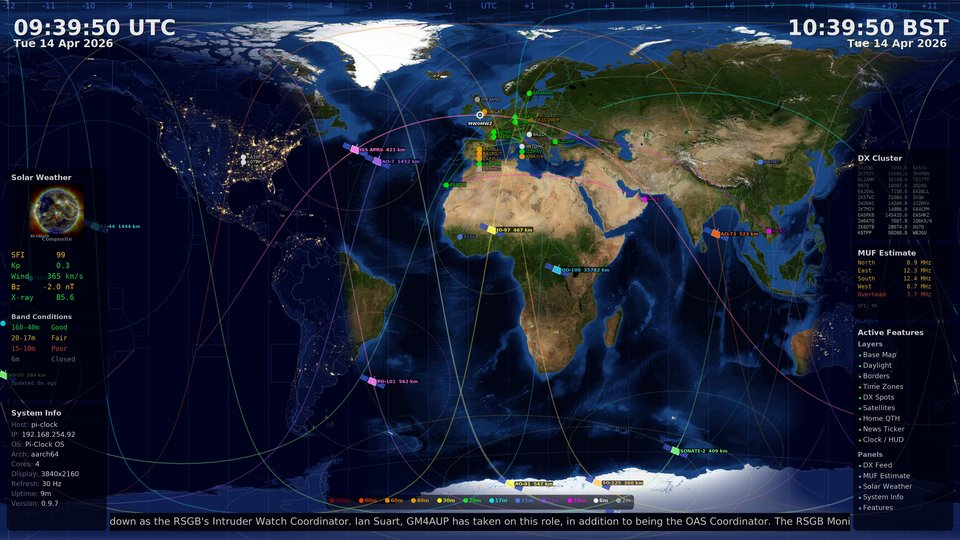

# Pi-Clock

[](https://github.com/MW0MWZ/Pi-Clock/actions/workflows/build-os.yml)
[](https://github.com/MW0MWZ/Pi-Clock/actions/workflows/packages.yml)
[](https://github.com/MW0MWZ/Pi-Clock/releases/latest)
[](https://github.com/MW0MWZ/Pi-Clock/releases)
[](LICENSE)

**The open-source world clock for ham radio operators.**

A free, community-driven alternative to GeoChron and HamClock. Pi-Clock turns a Raspberry Pi and any HDMI display into a beautiful, always-on ham radio command centre — showing real-time propagation data, DX spots, satellite tracks, solar weather, and more on top of NASA satellite imagery.

Runs headless. No desktop environment. Just plug in power and HDMI.

[](screenshot.jpg)
*Pi-Clock running at 4K on a Raspberry Pi 5 — click for full resolution*

---

## What You Get

**Live World Map** — NASA Blue Marble (day) and Black Marble (night) composited with a physically accurate greyline terminator. Smooth twilight blending that changes with latitude and season. Renders at native 1080p or 4K.

**DX Cluster Spots** — Live spots from telnet DX clusters drawn as great circle arcs between spotter and DX station. Band-coloured markers, callsign labels, distance and band filtering, and a scrolling feed panel.

**Satellite Tracking** — SGP4 orbit propagation for ISS, QO-100, and 15+ amateur satellites. Ground tracks (past + future), visibility footprints, and satellite icons on the map. TLEs auto-updated from Celestrak.

**Solar Weather** — Live data from NOAA SWPC: solar flux index, Kp index, solar wind speed, Bz, and X-ray flux. Cycling SDO sun images. Band condition predictions. MUF estimates for 5 directions from your QTH using real solar position and live SFI.

**News Ticker** — Scrolling headlines from ARRL, RSGB GB2RS, DX World, Southgate ARC, and NOAA space weather alerts. Smooth 30 FPS rendering on its own thread.

**Web Dashboard** — Configure everything from your phone or laptop. Layer toggles, DX filters, satellite selection, applet layout, WiFi, password — all from a clean HTTPS web interface.

**Overlays** — Country borders, time zone boundaries, CQ zones, Maidenhead grid squares, lat/lon graticule, sun and moon position markers, QTH marker with callsign label. Each layer independently toggleable with adjustable opacity.

**Boot Splash** — Custom Pi-Clock logo on boot. Quiet kernel, no scrolling text. Graphical output on tty7 so you can still Ctrl+Alt+F1 for a console login.

---

## Supported Hardware

Pi-Clock runs on every Raspberry Pi with HDMI output:

| Model | Status | Max Resolution | Notes |
|-------|--------|----------------|-------|
| Pi 1 Model A/B/A+/B+ | Supported | 1080p | HDMI hardware limited to 1080p. Single-core — see limitations below |
| Pi Zero / Zero W | Supported | 1080p | HDMI hardware limited to 1080p. Single-core — see limitations below |
| Pi Zero 2 W | Supported | 1080p | HDMI hardware limited to 1080p. Limited by 512MB RAM |
| Pi 2 | Supported | 1080p | HDMI hardware limited to 1080p |
| Pi 3 / 3A+ / 3B+ | Supported | 1080p | HDMI 1.4 limited to 1080p |
| Pi 4 | Supported | 4K | HDMI 2.0 — full 4K support |
| Pi 5 | Supported | 4K | HDMI 2.0 — full 4K support |

All you need is any Raspberry Pi with HDMI, a 4GB+ SD card, and a WiFi or Ethernet connection.


### Single-Core Limitations (Pi Zero, Pi Zero W, Pi 1)

These models have a single ARM11 core at 700MHz–1GHz. Pi-Clock adapts automatically:

- **Clock display** — hours and minutes only (no seconds) to reduce render load
- **News ticker** — Headlines + Full News mode only (smooth scroll disabled)
- **Max resolution** — capped at 1080p (the GPU can't keep up at higher resolutions)
- **Ticker frame rate** — capped at 30 FPS (vs display refresh rate on multi-core)

All other features work normally — DX cluster, satellites, solar weather, overlays, and the dashboard are fully functional on every Pi model.

---

## Quick Start

### 1. Flash

Download the latest image from [Releases](https://github.com/MW0MWZ/Pi-Clock/releases) and flash it:

```bash
xzcat Pi-Clock-*.img.xz | sudo dd of=/dev/sdX bs=4M status=progress
```

Or use [Raspberry Pi Imager](https://www.raspberrypi.com/software/) / [balenaEtcher](https://etcher.balena.io/).

### 2. Configure

Mount the boot partition and copy `pi-clock-config.txt.sample` to `pi-clock-config.txt`. Set your WiFi and callsign:

```
wifi_ssid=YourNetwork
wifi_password=YourPassword
wifi_country=GB

callsign=M1ABC
qth_lat=51.5
qth_lon=-0.1

hostname=pi-clock
timezone=Europe/London
display_resolution=1080p
```

See [pi-clock-config.txt.sample](pi-clock-config.txt.sample) for all options.

### 3. Boot

Insert the SD card, connect HDMI, power on. The world map starts automatically.

**Default login:** `pi-clock` / `raspberry`

The dashboard is at `https://<hostname>` (self-signed cert).

---

## Configuration

The `pi-clock-config.txt` boot config is processed once and deleted for security. Settings persist across reboots and OS upgrades.

This file also works for **recovery** — pop the SD card out, drop a fresh config on the boot partition from any PC, and reboot.

### WiFi

Supports up to 10 networks with priority ordering:

```
wifi_ssid=HomeNetwork
wifi_password=HomePass
wifi_ssid_2=MobileHotspot
wifi_password_2=HotspotPass
wifi_country=US
```

### Station Settings

```
callsign=M1ABC
qth_lat=42.36
qth_lon=-71.06
grid_square=FN42
center_lon=-71.0
```

Setting `center_lon` shifts the map so your QTH is at the centre.

### Security

SSH is key-only by default. To enable password auth:

```
enable_ssh_password=true
ssh_key=ssh-rsa AAAAB3... you@host
```

---

## Upgrading

### Packages (APK)

From the dashboard: click **Update Packages**.

Or from the command line:

```bash
apk update && apk upgrade
```

### OS Image (A/B slot)

```bash
sudo pi-clock-upgrade --install
sudo reboot
```

Installs to the inactive slot. Automatic rollback after 3 failed boots.

---

## Architecture

- **Renderer** — C, Cairo 2D graphics, direct Linux framebuffer output. Two-tier compositing cache minimises CPU usage. No X11, no Wayland.
- **Dashboard** — Go, single static binary with embedded web assets. HTTPS with auto-generated certificate.
- **OS** — RasPINE: Raspberry Pi OS kernel + Alpine Linux userland. A/B root partitions for safe upgrades. Persistent `/data` partition.
- **Packages** — Alpine APK with signed repository. Three packages: `pi-clock-renderer`, `pi-clock-dashboard`, `pi-clock-maps`.

---

## Building from Source

Requires Docker:

```bash
cd src
docker build -t pi-clock .
docker run --rm -v $(pwd)/../temp/output:/output pi-clock \
    --snapshot /output/test.png
```

The full OS image is built by GitHub Actions — see Actions > Build Pi-Clock OS Image.

---

## Credits

See [CREDITS.md](CREDITS.md) for full attribution of all third-party
libraries, algorithms, data sources, and imagery used in this project.

---

## License

GPL-2.0. See [LICENSE](LICENSE).

OS infrastructure based on [RasPINE](https://github.com/MW0MWZ/RasPINE) (GPL-2.0, Andy Taylor MW0MWZ).

---

## Contributing

Contributions welcome. The codebase is thoroughly commented and designed to be readable as a learning resource.

- C code compiles cleanly with `-Wall -Wextra` on Alpine/musl
- Test with Docker snapshot mode before submitting
- See [TODO.md](TODO.md) for the roadmap
